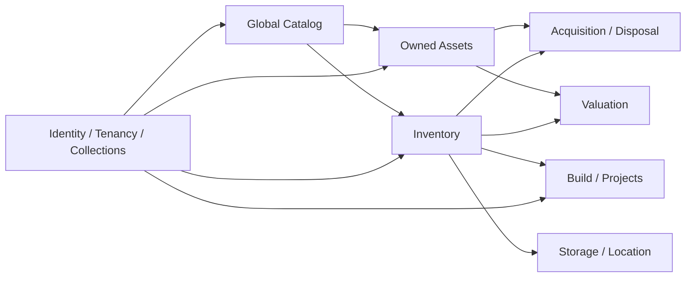

# System Overview

Brk-Trkr is organized as cooperating domains around a central distinction: **catalog truth is separate from owned physical state**.

## Domain flow

## Architectural domains

1. [Core Foundations](./domains/01-core-foundations.md)
2. [Global Catalog](./domains/02-global-catalog.md)
3. [Owned Assets](./domains/03-owned-assets.md)
4. [Inventory](./domains/04-inventory.md)
5. [Build & Project Management](./domains/05-build-projects.md)
6. [Valuation & Market Intelligence](./domains/06-valuation.md)
7. [Acquisition & Disposal](./domains/07-acquisition-disposal.md)
8. [Storage & Location](./domains/08-storage-location.md)

## Cross-cutting concerns

Identity, tenancy, security, caching, synchronization, auditing, asynchronous work, schema migrations, rate limiting, computer vision, and search span domain boundaries. See [Cross-cutting Architecture](./cross-cutting.md).

## Runtime repositories

| Layer | Repository |
|---|---|
| Frontend | `phpwalter/brk.trkr-fe` |
| API | `phpwalter/brk.trkr-api` |
| Database | `phpwalter/brk.trkr-db` |

Repository-specific engineering guidance is in [Development](../development/README.md).
